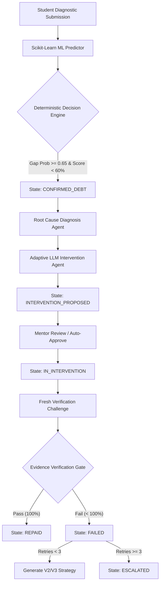

# Multi-Agent Execution Flow & Observability

## Lifecycle & Agent Interaction Architecture

## Agent Roles
1. **Evidence Agent:** Processes raw student responses and converts score signals into evidence rows.
2. **ML Predictor:** Evaluates 8 concept features to calculate knowledge gap probability.
3. **Deterministic Decision Engine:** Enforces state transition topology and retry limit boundaries.
4. **Diagnosis Agent:** Traverses the prerequisite graph to identify root-cause dependency weaknesses.
5. **Intervention Agent:** Generates multi-version ($V_1, V_2, V_3$) pedagogical strategies based on past database memory.
6. **Verification Gate:** Requires fresh passing evidence before allowing transition to `REPAID`.

## Live System Observability
- Event audit log (`Event` table in SQLite DB).
- REST Endpoint: `/api/system/trace/{student_id}`.
- UI Observability Panel (`SystemTraceDrawer.jsx`): Displays color-coded live event logs with auto-refresh polling.
