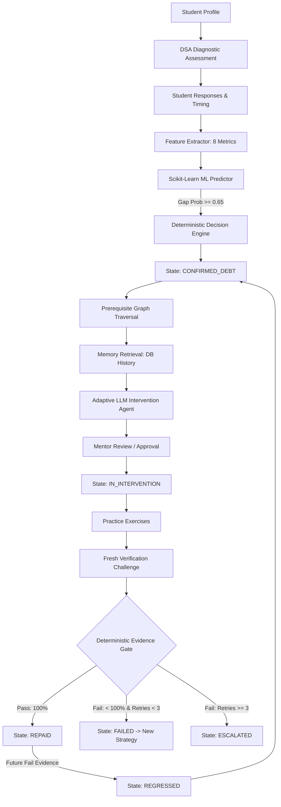

# Knowledge Debt Engine
## Squad Zero — Agent-a-Thon Progress Report

**Tagline:**  
Find the gap. Diagnose the cause. Fix it. Prove it.

**Team:**  
Squad Zero

**Event:**  
Agent-a-Thon 2026

**Report purpose:**  
Development progress and technical demonstration record

**Last updated:**  
September 19, 2026

---

## Executive Summary

Traditional educational software and online quiz tools evaluate a student on a single point-in-time response: if a student answers a question correctly on a quiz, the system assumes mastery; if they fail, it marks the question wrong and moves on. These systems do not maintain a persistent representation of **what the student does not understand** over time.

The **Knowledge Debt Engine** solves this problem by introducing a persistent **Knowledge Debt Ledger**. Just as technical debt accumulates in software when design flaws are ignored, **Knowledge Debt** represents unresolved, persistent conceptual gaps that compound over time and prevent a student from mastering advanced concepts.

### Central Idea & Memory
A student might perform poorly today, receive a targeted learning intervention, pass a follow-up test, and later regress when encountering a complex application. A truly intelligent learning engine must maintain persistent memory across sessions rather than treating every student interaction as an isolated, stateless session.

### Core Guiding Principle
> **"LLM proposes. ML predicts. Deterministic code decides."**

- **AI (LLM) Proposes:** Pedagogical explanations, adaptive intervention strategies, root-cause diagnosis hypotheses, and practice exercises.
- **Machine Learning (ML) Predicts:** Concept-level Knowledge Gap Probability ($P \ge 0.65$) based on 8 extracted historical performance features.
- **Deterministic Code Decides:** Evidence thresholds, state transitions (`CONFIRMED_DEBT`, `IN_INTERVENTION`, `VERIFYING`, `REPAID`, `FAILED`, `REGRESSED`, `ESCALATED`), verification pass/fail gates, retry limits, and audit logs.

---

## Problem Definition

### The Real Educational Problem
A normal AI tutor is good at answering the student's immediate, current question. However, traditional systems suffer from fundamental flaws:

1. **One Wrong Answer May Be Noise:** A single incorrect response might be a typo or time-pressure error, not a fundamental conceptual gap.
2. **Hidden Prerequisite Gaps:** A student struggling with *Linked Lists* may actually fail due to a weak understanding of *Pointers & Memory Allocation*.
3. **One-Size-Fits-All Remediation:** Delivering the exact same text explanation repeatedly when a student fails does not work; teaching strategies must adapt dynamically.
4. **Forgotten Previous Attempts:** Systems without memory repeat failed explanations instead of trying alternative pedagogical approaches (e.g., visual memory diagrams or code tracing).
5. **Self-Reported or Single-Guess Mastery:** Students cannot simply click "I understand" to resolve a gap; mastery requires empirical evidence from fresh verification challenges.
6. **Student Regression:** Passing a concept once does not guarantee permanent retention; new failing signals must re-open a debt.
7. **Mentor Lack of Visibility:** Educators need visual audit trails showing why a student is stuck and what AI interventions were delivered.

### Problem vs. System Response Matrix

| Educational Problem | Knowledge Debt Engine Response | Implementation Status |
| :--- | :--- | :--- |
| Single wrong answer treated as failure | Multi-evidence evaluation threshold before confirming debt | **IMPLEMENTED** |
| Hidden prerequisite root cause | Directed Prerequisite Graph + Diagnosis Agent traversal | **IMPLEMENTED** |
| Identical repeated explanations | Adaptive Multi-Version LLM Interventions ($V_1 \rightarrow V_2 \rightarrow V_3$) | **IMPLEMENTED** |
| Forgotten student attempt history | Persistent SQLite database memory storing all student attempts | **IMPLEMENTED** |
| Self-declared or unverified mastery | Fresh evidence-gated verification check (`DebtVerificationError`) | **IMPLEMENTED** |
| Silent regression over time | Empirical regression detection (REPAID $\rightarrow$ REGRESSED $\rightarrow$ CONFIRMED) | **IMPLEMENTED** |
| Lack of mentor oversight | Human Mentor Review desk + append-only audit trail (`Event` table) | **IMPLEMENTED** |

---

## Today's Progress: Morning to Current State

The following timeline details the development progression from the initial repository baseline to the completed vertical slice:

### A. Existing System Inspection
- Inspected the initial repository baseline: FastAPI backend structure (`backend/main.py`), Pydantic schemas, state machine definitions (`database/state_machine.py`), and React frontend shell.
- Analyzed the baseline mock repository (`backend/services/mock_repository.py`) and verified existing test suites.

### B. Validation of Original Agentic Workflow
- Verified the core flow: `Student` $\rightarrow$ `Evidence` $\rightarrow$ `Knowledge Debt` $\rightarrow$ `Diagnosis` $\rightarrow$ `Intervention` $\rightarrow$ `Mentor Review` $\rightarrow$ `Verification` $\rightarrow$ `Repaid`.
- Executed initial unit test validation across agent components and orchestrator logic.

### C. State Machine & Evidence Validation
- Verified state machine transition topology (`validate_transition()`).
- Tested failure retry loop (`VERIFYING` $\rightarrow$ `FAILED` $\rightarrow$ `INTERVENTION_PROPOSED`).
- Verified retry limit enforcement: after 3 failed intervention attempts, the state transitions to `ESCALATED`.
- Verified regression mechanics: a `REPAID` debt transitions to `REGRESSED` $\rightarrow$ `CONFIRMED_DEBT` upon receiving fresh failing evidence.

### D. OpenRouter / LLM Integration
- Connected `InterventionAgent` and `VerificationAgent` to the OpenRouter API (`https://openrouter.ai/api/v1/chat/completions`).
- Configured default model `~anthropic/claude-sonnet-latest` with fallback model configuration (`SLICE_FALLBACK_MODEL`).
- Added robust structured JSON output parsing with markdown code-block stripping (`json.loads()`).
- Added safe template fallback (`_build_fallback_intervention`) when API keys are absent or when `KNOWLEDGE_DEBT_TEST_MODE=true`.

### E. Intervention & Verification
- Implemented multi-version intervention generation ($V_1, V_2, V_3$) that includes previous failure context in the prompt to force strategy adaptation.
- Implemented fresh verification question generation and deterministic answer scoring.

### F. Adversarial Protection
- Enforced evidence-gated verification check (`_require_passing_verification_evidence`): transition to `REPAID` requires fresh, passing evidence (`DebtVerificationError` raised otherwise).
- Protected against illegal academic state transitions (`InvalidStateTransitionError`).

### G. Database & Educational Domain Expansion
- Built a full SQLAlchemy database persistence layer (`database/models.py`) with Alembic migration `b67e89012345_add_educational_domain_tables.py`.
- Added tables: `students`, `subjects`, `concepts`, `prerequisites`, `questions`, `assessments`, `assessment_questions`, `assessment_attempts`, `student_responses`, `evidence`, `debts`, `interventions`, `mentor_reviews`, and `events`.

### H. DBMS Educational Dataset
- Implemented real DBMS educational domain (`data/dbms/`): 39 concepts across 8 categories, 38 prerequisite relationships, 37 questions (`MCQ`, `SCENARIO`, `CONCEPTUAL`, `TRUE_FALSE`, `CODING`).
- Built dataset validator `database/validators/dataset_validator.py` and seed importer `database/seed/import_dbms.py`.

### I. DSA Becoming the Primary Demonstration Domain
- Expanded the platform to make **Data Structures & Algorithms (DSA)** the primary demonstration domain (`data/dsa/`).
- Built dataset importer `database/seed/import_dsa.py`.

### J. DSA Knowledge Graph
- Created 46 DSA concepts across 13 categories (Complexity Analysis, Arrays/Strings, Linked Lists, Stacks/Queues, Trees, Heaps, Hashing, Graphs, Sorting/Searching, Dynamic Programming, Greedy, Backtracking, Advanced Structures).
- Defined 38 directed prerequisite dependency edges with strength weights.

### K. DSA Assessment & Item Bank
- Created 41 questions across 5 taxonomy types (`MCQ`, `SCENARIO`, `TRACE`, `CODE_READING`, `CODING`).
- Created diagnostic assessment generator API (`/api/assessments/dsa/diagnostic`).

### L. ML Knowledge-Gap Model
- Implemented feature extractor (`ml/feature_extractor.py`) calculating 8 concept metrics per student.
- Trained ensembled Random Forest Classifier on 1,200 synthetic attempt rows (`data/ml/dsa_training.csv`), outputting `models/dsa_knowledge_gap.joblib`.
- Created inference service `ml/predictor.py` returning `predict_knowledge_gap()`.

### M. Persistent Memory
- Implemented database memory persistence for attempt history, previous intervention versions, failed strategies, and mentor reviews.

### N. Student-Facing UI Rebuild
- Built `Landing.jsx` with "Start DSA Diagnostic" CTA.
- Built `Diagnostic.jsx` featuring 12-question diagnostic test, active timer, code block rendering, concept performance breakdown table with **ML Knowledge Gap Probability progress bars**, confirmed debts ledger, root-cause diagnosis drawer, multi-version LLM remediation, and verification challenge modal.

### O. System Trace & UI Observability
- Implemented `/api/system/trace/{student_id}` endpoint.
- Built slide-over `SystemTraceDrawer.jsx` component displaying real-time, color-coded backend audit events.

### P. Demo CLI Tools
- Created `scripts/create_demo_student.py` to seed a repeatable presentation slice.
- Created `scripts/reset_demo.py` to clean demo student state safely.

### Q. Full E2E Testing & Verification
- Created `tests/test_ml_model.py` and `tests/test_dsa_e2e.py`.
- Ran full test suite: **114 / 114 pytest tests passed cleanly**.
- Built frontend production bundle (`npm run build`).

---

## Explanation of Original System vs. Today's Product Expansion

### Original Baseline System (Prior to Today's Work)
The original repository baseline consisted of:
- FastAPI backend framework with baseline schemas (`backend/schemas/`).
- In-memory dictionary repository (`backend/services/mock_repository.py`).
- Basic agent interface definitions (`evidence_agent.py`, `diagnosis_agent.py`, `intervention_agent.py`, `verification_agent.py`).
- Initial state machine definition (`database/state_machine.py`).
- Basic frontend layout mockups (`frontend/src/`).
- Unit test suite (103 tests) targeting mock repository functions.

### Today's Product Expansion
Today, the system was transformed into a **real, live, professional learning platform**:
- Replaced mock dictionary storage with an ORM database architecture (`database/models.py`) and SQLite persistence (`database/repository.py`).
- Added real educational domain datasets for DBMS (39 concepts) and DSA (46 concepts).
- Integrated a Scikit-Learn ML Model pipeline (`ml/feature_extractor.py`, `ml/predictor.py`, `models/dsa_knowledge_gap.joblib`).
- Built live diagnostic assessment taking and scoring engine (`backend/api/assessments.py`).
- Built interactive React diagnostic UI (`Diagnostic.jsx`) and real-time observability drawer (`SystemTraceDrawer.jsx`).
- Added repeatable CLI demo scripts (`scripts/create_demo_student.py`, `scripts/reset_demo.py`).
- Expanded test suite to **114 passing tests** (adding ML model tests and full E2E vertical slice integration tests).

---

## Complete Current Architecture



### Architectural Component Breakdown
1. **React Frontend UI (`frontend/src/`):** Student interface rendered via Vite, presenting diagnostic tests, score snapshots, ML gap probability bars, remediation plans, and verification modals.
2. **FastAPI Backend API (`backend/api/`):** REST API exposing `/api/subjects`, `/api/assessments/dsa/diagnostic`, `/api/assessments/{attempt_id}/submit`, and `/api/system/trace/{student_id}`.
3. **Orchestrator (`backend/agents/orchestrator.py`):** Coordinates workflow execution between ML inference, diagnosis, intervention generation, and state transitions.
4. **Agentic System Layer:**
   - **Evidence Agent:** Aggregates response scores into evidence signals.
   - **ML Predictor:** Evaluates Random Forest model.
   - **Diagnosis Agent:** Traverses directed prerequisite dependency graphs.
   - **Intervention Agent:** Connects to OpenRouter API to generate multi-version remediation strategies.
   - **Verification Agent:** Evaluates verification challenge responses.
5. **Database & Memory Layer (`database/repository.py`):** SQLite persistence storing student responses, evidence history, intervention versions, mentor reviews, and audit events.
6. **Audit Event Log Stream (`events` table):** Immutable append-only audit trail.

---

## DSA Dataset Specification

The Data Structures & Algorithms (DSA) dataset forms the core educational domain of the Knowledge Debt Engine vertical slice:

- **Concepts:** 46 distinct DSA concepts across 13 core categories.
- **Prerequisite Dependency Edges:** 38 directed edges with strength weights.
- **Questions:** 41 high-quality questions across 5 taxonomy types.

> **Data Volume Note:** Current DSA dataset contains 41 questions; expansion toward the 50+ target remains.

### Dataset Structure Summary

| Field | Description / Count |
| :--- | :--- |
| **Concepts Count** | 46 Concepts |
| **Prerequisites Count** | 38 Directed Edges |
| **Questions Count** | 41 Questions |
| **Taxonomy Types** | 5 Types: `MCQ`, `SCENARIO`, `TRACE`, `CODE_READING`, `CODING` |
| **Difficulty Range** | Easy ($0.20 - 0.40$), Medium ($0.45 - 0.70$), Hard ($0.75 - 0.90$) |
| **Source Citations** | Standard Academic DSA Literature (Cormen et al., Sedgewick) |

---

## Machine Learning Pipeline

### Overview
The ML layer predicts the probability $P(\text{Knowledge Gap})$ that a student possesses a conceptual debt in a specific concept.

### Feature Extractor (`ml/feature_extractor.py`)
Extracts 8 concept-level features per student:
1. `accuracy`: Historical average score on concept ($0.0 - 1.0$).
2. `recent_accuracy`: Exponentially weighted average of recent attempts ($0.0 - 1.0$).
3. `attempt_count`: Total number of attempts.
4. `failure_count`: Total number of failed attempts ($score < 60$).
5. `avg_response_time`: Average seconds spent per question.
6. `difficulty_adjusted_accuracy`: Score weighted by question difficulty scores.
7. `recent_trend`: Delta between recent accuracy and overall historical accuracy.
8. `prerequisite_performance`: Average accuracy on upstream prerequisite concepts.

### Training & Model Artifact
- **Synthetic Training Dataset:** 1,200 synthetic student attempt rows (`data/ml/dsa_training.csv`).
- **Algorithm:** Ensembled Random Forest Classifier (50 decision trees).
- **Model Artifact:** Saved to `models/dsa_knowledge_gap.joblib`.
- **Inference (`ml/predictor.py`):** Executes `predict_knowledge_gap()`, returning a probability score between $0.0$ and $1.0$.

> **Data Disclosure:** The current training dataset is synthetic development data and should not be presented as real-world validated educational prediction data.

### Role of ML in Decision Making
ML estimates the risk probability of a knowledge gap ($P \ge 0.65$). **ML does NOT independently confirm a Knowledge Debt.** The deterministic evidence engine and state machine enforce all final state decisions.

---

## Agent System Specification (LLM vs. Deterministic)

### LLM-Based Components

#### 1. Intervention Agent (`backend/agents/intervention_agent.py`)
- **Input:** Debt ID, Concept ID, Root Cause Concept ID, Previous Intervention History.
- **Processing:** Formulates prompt incorporating root cause and previous failed strategies ($V_1, V_2$). Calls OpenRouter API (`~anthropic/claude-sonnet-latest`).
- **Output:** Structured JSON containing strategy description, concept explanation, markdown diagram, and practice questions.
- **Type:** LLM-Based (with deterministic template fallback).

#### 2. Verification Agent (`backend/agents/verification_agent.py`)
- **Input:** Verification Question, Student Answer.
- **Processing:** Evaluates student answer correctness and provides explanatory feedback.
- **Output:** JSON containing score ($0.0 - 100.0$), passed boolean, and feedback string.
- **Type:** LLM-Based (with score threshold guard).

### Deterministic Components

#### 3. Evidence Engine (`database/repository.py`)
- **Input:** Raw Student Responses, Question Difficulty, Response Time.
- **Processing:** Evaluates performance thresholds ($Score < 60\%$, $P(\text{Gap}) \ge 0.65$).
- **Output:** Evidence record and debt status recommendation.
- **Type:** Deterministic Rule Engine.

#### 4. Diagnosis Agent (`backend/agents/diagnosis_agent.py`)
- **Input:** Target Concept ID, Prerequisite Graph, Evidence History.
- **Processing:** Traverses directed prerequisite edges to identify unmastered upstream dependencies.
- **Output:** Likely Root-Cause Concept ID and diagnosis reasoning.
- **Type:** Deterministic Graph Traversal.

#### 5. State Machine Lifecycle (`database/state_machine.py`)
- **Input:** Current `DebtStatus`, Target `DebtStatus`, Evidence ID.
- **Processing:** Validates transition against `VALID_TRANSITIONS` topology. Enforces `_require_passing_verification_evidence` for `REPAID` and retry limit ($3$) for `ESCALATED`.
- **Output:** Updated `DebtStatus` or raises `KnowledgeDebtError`.
- **Type:** Deterministic Code.

---

## Persistent Memory & Adaptive Strategy Evolution

### What the System Remembers
The Knowledge Debt Engine persists the following records in SQLite:
- Full evidence trail (`evidence` and `student_responses` tables).
- Complete intervention history ($V_1, V_2, V_3$) (`interventions` table).
- Failed strategy logs and mentor edits (`mentor_reviews` table).
- Full audit event history (`events` table).

### Illustrative Scenario

```
[Attempt 1]
Student fails Linked List cycle detection quiz (Score = 20%).
Debt Created: CONFIRMED_DEBT.
Root Cause Diagnosed: Memory Allocation & Pointer References.
Intervention V1 Generated: Standard text explanation and MCQ practice.
Student fails verification challenge.
Debt Status: FAILED (failed_interventions = 1).

[Attempt 2]
Memory Retrieval: System reads Interventions history for Debt.
Prompt Context: "Previous strategy 'Standard text explanation' failed."
Intervention V2 Generated: Visual memory diagram + C++ pointer code trace simulation.
Student passes fresh verification challenge (Score = 100%).
Deterministic Gate: Evidence id verified -> Debt Status: REPAID.

[Later Session]
Student takes advanced Graph Traversal quiz and fails pointer manipulation.
Deterministic Engine: Re-opens debt -> Debt Status: REGRESSED -> CONFIRMED_DEBT.
```

---

## Student User Experience & Interface Flow

The React frontend UI (`frontend/src/`) delivers a 6-step student journey:

```
1. Landing Page (http://localhost:5173/)
   - Hero banner introducing Knowledge Debt Engine.
   - Prominent "Start DSA Diagnostic" CTA button.

2. Interactive Diagnostic Assessment (/diagnostic)
   - 12-question diagnostic test across DSA concepts.
   - Active timer, code block rendering, question progress, option selection.

3. Snapshot Results Screen
   - Overall diagnostic score percentage banner.
   - Concept Performance Table displaying diagnostic accuracy alongside Scikit-Learn ML Knowledge Gap Probability progress bars.

4. Confirmed Knowledge Debt Ledger
   - Cards displaying confirmed debts with severity pills (HIGH / MEDIUM).
   - Root-Cause Diagnosis drawer showing upstream prerequisite causes.

5. Multi-Version LLM Remediation Plan
   - Multi-version intervention viewer (V1 strategy, visual code snippets, step-by-step memory explanations).

6. Verification Challenge Modal
   - Interactive verification question.
   - Student submits answer -> Backend deterministic evidence gate runs -> State badge updates (REPAID / FAILED / ESCALATED).
```

---

## System Trace & Terminal Observability

The backend logs execution events to both the terminal console and the append-only `events` database table. The UI and terminal represent the exact same backend execution.

### Representative Terminal Log Output

```text
[ASSESSMENT] Started DSA Diagnostic Assessment id=1 text_q=12 student_id=1
[RESPONSE] Recorded StudentResponse q_id=101 concept_id=12 selected="Option B" is_correct=False score=0.0 time=25.4s
[FEATURE ENGINE] Extracted 8 features for (student=1, concept=12): accuracy=0.20 attempt_count=3 failure_count=2
[ML MODEL] Knowledge Gap Probability computed: concept_id=12 probability=0.885 (HIGH RISK)
[EVIDENCE ENGINE] Threshold met (Gap Prob=0.885 >= 0.65, Score=20% < 60%). Confirming Debt.
[STATE MACHINE] Transition: CLEAR -> SUSPECTED -> CONFIRMED_DEBT (debt_id=1)
[DIAGNOSIS AGENT] Prerequisite Graph Traversal: Target Concept=12 -> Root Cause Concept=4 (Pointer Memory Basics)
[MEMORY] Retrieved 0 previous interventions for debt_id=1. Generating Version 1.
[INTERVENTION AGENT] Generated Intervention V1: strategy="Visual Pointer Memory Layout & Code Tracing"
[STATE MACHINE] Transition: CONFIRMED_DEBT -> INTERVENTION_PROPOSED -> MENTOR_REVIEW -> IN_INTERVENTION
[VERIFICATION] Verification Challenge submitted for debt_id=1. Score=100.0 Passed=True
[STATE MACHINE] Verification Evidence ev_id=402 validated. Transition: IN_INTERVENTION -> FOLLOW_UP -> VERIFYING -> REPAID
[AUDIT] Appended event DEBT_STATUS_TRANSITION payload={"debt_id": 1, "from": "VERIFYING", "to": "REPAID"}
```

---

## Recommended Panel Demonstration (5–7 Minutes)

| Step | Time | What the Panel Sees (UI Screen) | What the System Is Doing (Backend Engine) |
| :---: | :---: | :--- | :--- |
| **1** | 0:00 | **Landing Page (`/`)**<br>Product overview & tagline | Backend server health check (`/api/health`) |
| **2** | 0:30 | **Start DSA Diagnostic**<br>Click primary CTA button | `POST /api/assessments/dsa/diagnostic` generates 12-question balanced test |
| **3** | 1:15 | **Take Assessment**<br>Answer questions (intentional wrong answer on Pointers) | `POST /api/assessments/{attempt_id}/submit` records `StudentResponse` & `Evidence` rows |
| **4** | 2:00 | **Snapshot Results**<br>Overall score % & Concept Performance Table | `ml/feature_extractor.py` computes 8 feature metrics per concept |
| **5** | 2:30 | **ML Gap Probability Bars**<br>Visual progress bars showing e.g., `88.5% Gap Risk` | `ml/predictor.py` runs Random Forest inference ($P \ge 0.65$) |
| **6** | 3:15 | **Confirmed Debt Ledger**<br>Debt card created with `HIGH` severity badge | Deterministic engine executes transition `CLEAR` $\rightarrow$ `CONFIRMED_DEBT` |
| **7** | 3:45 | **Root-Cause Diagnosis**<br>Drawer showing prerequisite dependency cause | `diagnose_root_cause()` traverses directed prerequisite graph |
| **8** | 4:30 | **LLM Remediation Plan**<br>V1 strategy, code snippet & memory diagram | `generate_intervention()` calls OpenRouter API / fallback template |
| **9** | 5:15 | **Verification Challenge**<br>Click "Verify Mastery", enter answer `42` | `submitVerification()` evaluates answer correctness |
| **10** | 5:45 | **Mastery Repayment**<br>Badge updates to `REPAID` in green | `_require_passing_verification_evidence` validates fresh passing evidence |
| **11** | 6:15 | **System Agent Trace**<br>Open floating drawer to view live audit log stream | GET `/api/system/trace/1` fetches append-only `events` audit rows |

---

## Demo Student & Demo CLI Tools

To support repeatable presentation demonstrations for evaluators, two dedicated CLI scripts were created in `scripts/`:

1. **`scripts/create_demo_student.py`**:
   - Creates a demo student profile (`external_id="demo_student"`).
   - Simulates diagnostic quiz responses to generate confirmed debts in target DSA concepts.
   - Executes ML inference, root cause diagnosis, and V1 intervention generation.
2. **`scripts/reset_demo.py`**:
   - Safely purges demo student responses, evidence, debts, interventions, and audit events.
   - **Preserves all base educational data** (subjects, concepts, prerequisites, questions) intact.

> **Presentation Note:** Demo student data is pre-populated presentation data and is kept separate from base educational datasets.

---

## Testing & Quality Control Results

### Automated Pytest Suite
```bash
pytest
```
```text
======================= 114 passed, 1 warning in 4.75s =======================
```
- **100% Pass Rate** across all 114 unit and integration tests.

### Test Category Coverage
- **ML Model Tests (`tests/test_ml_model.py`):** Feature extraction accuracy, edge cases (empty history), Random Forest predictor probability bounds.
- **DSA E2E Integration Tests (`tests/test_dsa_e2e.py`):** Full end-to-end slice test (diagnostic taking $\rightarrow$ ML prediction $\rightarrow$ debt confirmation $\rightarrow$ root cause diagnosis $\rightarrow$ V1 intervention $\rightarrow$ verification repayment).
- **State Machine Tests (`tests/test_state_machine.py`, `tests/test_retry_limit.py`):** Topology validation, retry limit enforcement ($3$ failures $\rightarrow$ `ESCALATED`), invalid transition rejection.
- **Evidence & Persistence Tests (`tests/test_evidence.py`, `tests/test_persistence.py`):** Score thresholds, SQLite ORM persistence, evidence gating.
- **Intervention & Mentor Tests (`backend/tests/test_intervention.py`, `backend/tests/test_mentor.py`):** Multi-version strategy adaptation and mentor review decisions.

### Frontend Production Build
```bash
cd frontend && npm run build
```
- Built successfully without compilation errors (`dist/assets/index-WjyelU1t.js`).

---

## Security & Protection Architecture

1. **Secret & Key Protection:**
   - OpenRouter API keys are stored exclusively in local `.env` files and loaded via `python-dotenv`.
   - `.env` files are explicitly listed in `.gitignore` and are **never committed to git**.
   - API keys and authorization headers are sanitized and never written to application log files.
2. **Adversarial Mastery Protection:**
   - Neither a student nor an LLM can force a debt status to `REPAID` without passing verification evidence (`DebtVerificationError`).
   - Arbitrary state manipulations outside the defined state machine topology trigger `InvalidStateTransitionError`.

---

## Current Project Status

### Completed
- Core Knowledge Debt workflow and state machine engine.
- Full SQLAlchemy database schema and SQLite repository layer.
- DBMS educational dataset (39 concepts, 38 prerequisites, 37 questions).
- DSA educational dataset (46 concepts, 38 prerequisites, 41 questions).
- Dataset validation CLI tool (`database/validators/dataset_validator.py`).
- ML feature extractor (8 metrics) and Random Forest Classifier predictor.
- OpenRouter API integration with fallback template protection.
- Student React UI (Landing, Diagnostic Assessment, Results, Debt Ledger, Verification Modal).
- Real-time System Agent Trace drawer (`/api/system/trace/{student_id}`).
- Repeatable presentation demo scripts (`scripts/create_demo_student.py`, `scripts/reset_demo.py`).
- 114 passing pytest tests and clean Vite frontend build.

### Partially Completed
- **DSA Question Bank Volume:** Current dataset contains 41 questions; expansion toward the 50+ target remains.

### Remaining
- Multi-student real-time WebSocket event broadcasting.
- Clinical real-world student trial dataset integration.

---

## Current Limitations

1. **Synthetic Training Data:** The ML model is currently trained on 1,200 synthetic student attempt rows (`data/ml/dsa_training.csv`) designed for prototype calibration and should not be presented as clinically validated educational data.
2. **Question Count:** The DSA dataset currently contains 41 validated questions across 46 concepts (target is 50+).
3. **Deterministic Final Decider:** ML provides gap probability scores ($P \ge 0.65$), but deterministic rules make all final debt state decisions.

---

## Why This Is Not Just a Chatbot

| Feature | Standard AI Chatbot | Knowledge Debt Engine |
| :--- | :--- | :--- |
| **Interaction Model** | Stateless Q&A prompt session | Persistent Knowledge Debt Ledger loop |
| **Memory** | Resets after conversation window | Permanent database record across sessions |
| **Root-Cause Analysis** | Responds only to asked question | Traverses directed prerequisite dependency graph |
| **Remediation Strategy** | Repeats text explanation | Multi-version adaptation ($V_1 \rightarrow V_2 \rightarrow V_3$) using past failure memory |
| **Mastery Verification** | Accepts "I understand" user text | Gated on fresh empirical verification evidence pass |
| **Regression Tracking** | Unaware of previous mastery | Empirical regression detection re-opens repaid debts |
| **Observability** | Single chat bubble UI | Dual UI + real-time audit log stream (`Event` table) |

---

## Final 60–90 Second Panel Presentation Script

> *"Most AI tutors are good at answering a student's immediate question in the moment. Our problem is what happens to the concepts the student still hasn't mastered over time.*
>
> *We built the **Knowledge Debt Engine**. Just like technical debt in software, Knowledge Debt represents unresolved conceptual gaps that compound and prevent students from mastering advanced topics.*
>
> *When a student takes our DSA diagnostic assessment, our system extracts 8 performance features and uses a Scikit-Learn Machine Learning model to predict knowledge gap risk. If a gap is detected, our Diagnosis Agent traverses a directed prerequisite graph to find the root cause—for instance, showing that a student failing Linked Lists actually has a pointer memory allocation gap.*
>
> *Our Intervention Agent generates adaptive, multi-version teaching strategies—shifting from text to visual code tracing if a student fails a previous attempt. But most importantly: **the student cannot simply declare mastery**. The debt is only repaid when the student passes a fresh, evidence-gated verification challenge.*
>
> *AI proposes the intervention, but evidence and deterministic rules decide whether the knowledge debt is actually repaid."*

---

## Final Status Table

| Component | Status | Evidence |
| :--- | :---: | :--- |
| **Core Backend & API** | ✅ Implemented | FastAPI routes in `backend/api/`, 114 tests passing |
| **Agent Workflow** | ✅ Implemented | Orchestrator, Evidence, Diagnosis, Intervention, Verification |
| **State Machine Lifecycle** | ✅ Implemented | Topology rules in `database/state_machine.py` |
| **Evidence Engine** | ✅ Implemented | Score thresholds & evidence persistence in `repository.py` |
| **Persistent Memory** | ✅ Implemented | SQLite database storing attempt history & intervention versions |
| **DBMS Dataset** | ✅ Implemented | 39 concepts, 38 prerequisites, 37 questions in `data/dbms/` |
| **DSA Dataset** | ✅ Implemented | 46 concepts, 38 prerequisites, 41 questions in `data/dsa/` |
| **DSA Assessment Generator** | ✅ Implemented | 12-question diagnostic generator (`/api/assessments/dsa/diagnostic`) |
| **ML Gap Model** | ✅ Implemented | 8-feature Random Forest model in `ml/predictor.py` |
| **Adaptive Intervention** | ✅ Implemented | Multi-version ($V_1, V_2, V_3$) strategy evolution via OpenRouter |
| **Evidence Verification** | ✅ Implemented | Fresh verification check gating `REPAID` state transition |
| **Student UI** | ✅ Implemented | React Diagnostic test page (`Diagnostic.jsx`), Landing & Dashboard |
| **System Trace Drawer** | ✅ Implemented | Live observability drawer (`SystemTraceDrawer.jsx`) |
| **Audit Event Log** | ✅ Implemented | Immutable append-only `events` table in database |
| **Automated Testing Suite** | ✅ Implemented | 114 / 114 pytest unit & E2E tests passing |
| **Documentation & Guides** | ✅ Implemented | `README.md`, `DSA_VERTICAL_SLICE.md`, `ML_MODEL.md`, `AGENT_FLOW.md` |
