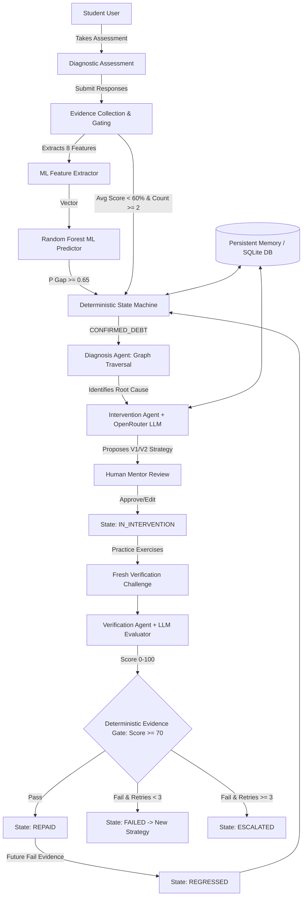

# Knowledge Debt Engine
## Squad Zero — Agent-a-Thon Progress Report

**Project:** Knowledge Debt Engine  
**Team:** Squad Zero  
**Event:** Agent-a-Thon 2026  
**Tagline:** *"Find the gap. Diagnose the cause. Fix it. Prove it."*  
**Core Principle:** *"LLM proposes. ML predicts. Deterministic code decides."*  
**Last Updated:** September 19, 2026  

---

## Executive Summary

Traditional AI educational tools and online quiz platforms evaluate students on a single point-in-time response: if a student answers a question correctly, the system assumes conceptual mastery; if they fail, it marks the answer wrong and moves on. Crucially, these systems do not maintain a persistent representation of **what the student still does not understand** across time.

The **Knowledge Debt Engine** re-imagines student learning by introducing a persistent **Knowledge Debt Ledger**. Just as technical debt accumulates in software engineering when architectural flaws remain unaddressed, **Knowledge Debt** represents unresolved, compounding conceptual gaps that prevent students from mastering advanced topics.

### Central Principle
> **"LLM proposes. ML predicts. Deterministic code decides."**

- **LLM Proposes:** Generates targeted explanations, adaptive multi-version remediation plans ($V_1 \rightarrow V_2 \rightarrow V_3$), root-cause diagnostic hypotheses, and transfer verification challenges.
- **ML Predicts:** Estimates concept-level Knowledge Gap Risk ($P \ge 0.65$) using a Random Forest Classifier trained on 8 extracted historical performance metrics.
- **Deterministic Code Decides:** Serves as the final authority for state transitions and evidence gates, enforcing multi-evidence threshold validation, state machine lifecycle rules, prerequisite graph traversals, verification pass/fail score gates ($\text{score} \ge 70.0$), retry limits (max 3 failures before escalation), and persistent audit event logs.

---

## 1. Problem Statement

Current AI tutoring platforms are built for short-term assistance rather than long-term mastery. An AI tutor typically answers a student's immediate, current question without tracking whether underlying conceptual gaps persist or compound over time.

```
       [ Student Response ]
                │
                ▼
      [ Evidence Collection ]
                │
   ┌────────────┴────────────┐
   │                         │
[ Single Weak Result ]   [ Repeated Failing Evidence ]
   │                         │
   ▼                         ▼
[ SUSPECTED State ]      [ CONFIRMED_DEBT State ]
                             │
                             ▼
                [ Prerequisite Graph Diagnosis ]
                             │
                             ▼
                [ Multi-Version LLM Remediation ]
                             │
                             ▼
                [ Fresh Verification Challenge ]
                             │
           ┌─────────────────┴─────────────────┐
           │                                   │
   [ Pass: Score >= 70 ]              [ Fail: Score < 70 ]
           │                                   │
           ▼                                   ▼
    [ REPAID State ]                    [ FAILED State ]
           │                                   │
   [ Future Failing Evidence ]          ┌──────┴──────┐
           │                            │             │
           ▼                   [ Retries < 3 ]   [ Retries >= 3 ]
   [ REGRESSED State ]                  │             │
           │                            ▼             ▼
           └──────────────► [ INTERVENTION_PROPOSED ] [ ESCALATED ]
```

### The Knowledge Debt Problem Dynamics
1. **Repeated Concept Failures:** A student can repeatedly fail questions tied to the same underlying concept across different quizzes or homework assignments without any centralized ledger tracking the pattern.
2. **Evidence Accumulation:** Weak evidence alone (such as a single incorrect answer) should not immediately trigger a confirmed debt; it may reflect a typo or time constraint. The system accumulates evidence over time.
3. **Evidence Threshold Gating:** A single weak result places a concept into `SUSPECTED` state (or neutral buffer). Only repeated failing evidence ($\ge 2$ evidence records, average score $< 60.0\%$) confirms a `CONFIRMED_DEBT`.
4. **Root-Cause Prerequisite Diagnosis:** A student struggling with an advanced topic (e.g., *Cycle Detection*) often suffers from an unmastered prerequisite concept (e.g., *Fast and Slow Pointers* or *Linked List Traversal*). The engine diagnoses likely prerequisite root causes via graph analysis.
5. **Targeted Adaptive Remediation:** When a student fails a remediation attempt, delivering the exact same explanation repeatedly is ineffective. The system uses past intervention memory to adapt teaching strategies dynamically ($V_1 \rightarrow V_2 \rightarrow V_3$).
6. **Fresh Verification Required:** Mastery cannot be self-reported or assumed from reading a lesson. A student must complete a fresh, transfer-style verification challenge before a debt can be declared `REPAID`. Repayment is an evidence-gated application state, not a claim of permanent mastery.
7. **Failure Escalation:** If a student fails verification multiple times, the state machine enforces a retry limit (3 failed interventions), escalating the debt to `ESCALATED` for human mentor review.
8. **Empirical Regression:** If a student who previously repaid a debt demonstrates fresh failing evidence on that concept in later sessions, the debt transitions from `REPAID` $\rightarrow$ `REGRESSED` $\rightarrow$ `CONFIRMED_DEBT`.

---

## 2. Why This Is Not a Chatbot

> *"An AI tutor answers the student's current question. Knowledge Debt Engine maintains the student's unresolved knowledge debts over time and requires fresh evidence before declaring mastery."*

Traditional conversational AI tutors suffer from fundamental structural limitations that make them unsuitable for persistent educational debt tracking:

| Dimension | Standard AI Tutor / Chatbot | Knowledge Debt Engine |
| :--- | :--- | :--- |
| **Architectural Model** | Stateless Q&A conversational loop | State-machine-driven Knowledge Debt Ledger loop |
| **Long-Term Memory** | Lost when context window resets | 14 persistent database entities tracking historical performance |
| **Root-Cause Analysis** | Addresses only the asked prompt | Traverses directed prerequisite graphs to find underlying gaps |
| **Remediation Strategy** | Repeats generic text responses | Multi-version strategy adaptation ($V_1 \rightarrow V_2 \rightarrow V_3$) using past failure context |
| **Mastery Verification** | Accepts user statements ("I get it now") | Requires fresh, evidence-gated verification check ($\text{score} \ge 70.0$) |
| **Regression Mechanics** | Unaware of past performance decay | Automatically re-opens debts (`REGRESSED` $\rightarrow$ `CONFIRMED_DEBT`) upon fresh failing evidence |
| **Observability** | Single chat bubble UI | Slide-over System Trace & persistent audit event log (`events` table) |

---

## 3. Agent & System Architecture

The Knowledge Debt Engine combines deterministic software engineering with targeted Machine Learning and LLM reasoning.



### Component Breakdown & Control Responsibilities

1. **Evidence Agent & Rules (`database/repository.py` & `backend/agents/evidence_agent.py`):**
   - *Role:* Aggregates raw student responses into evidence signals (`quiz`, `coding`, `follow_up`, `leetcode`) and applies deterministic threshold rules.
   - *Type:* **Deterministic Application Logic**.

2. **ML Knowledge-Gap Predictor (`ml/predictor.py` & `ml/feature_extractor.py`):**
   - *Role:* Extracts 8 feature metrics per concept and estimates gap probability $P(\text{knowledge\_gap} \mid \text{evidence})$.
   - *Type:* **Deterministic Machine Learning Inference** (Random Forest Classifier). ML knowledge-gap probability serves as an additional diagnostic signal; deterministic evidence rules remain responsible for debt confirmation.

3. **Diagnosis Agent (`backend/agents/diagnosis_agent.py`):**
   - *Role:* Traverses directed prerequisite graph edges (`prerequisites` table) to pinpoint unmastered upstream root-cause concepts.
   - *Type:* **Deterministic Graph Traversal**. Despite the agent naming convention, the current diagnosis implementation performs deterministic prerequisite-graph traversal rather than LLM reasoning.

4. **Intervention Agent (`backend/agents/intervention_agent.py`):**
   - *Role:* Calls OpenRouter API (`~anthropic/claude-sonnet-latest`) to generate structured, multi-version remediation plans ($V_1, V_2, V_3$) using past failed strategy memory.
   - *Type:* **LLM Component** (with fallback template safety).

5. **Verification Agent (`backend/agents/verification_agent.py`):**
   - *Role:* Generates fresh transfer-style evaluation questions and evaluates student response text.
   - *Type:* **LLM Component** (for question generation and text scoring; final pass/fail gate is enforced deterministically).

6. **Orchestrator (`backend/agents/orchestrator.py`):**
   - *Role:* Coordinates data flow across diagnostic taking, ML gap scoring, prerequisite diagnosis, intervention generation, mentor reviews, and verification scoring.
   - *Type:* **Deterministic Control Logic**.

7. **Deterministic State Machine (`database/state_machine.py`):**
   - *Role:* Serves as final authority for state transitions, validating transition topology, enforcing evidence gates, checking retry limits, and preventing invalid academic transitions.
   - *Type:* **Deterministic Application Logic**.

8. **Human Mentor Review (`backend/api/mentor.py`, `database/repository.py`):**
   - *Role:* Provides an educator interface for inspecting, approving, editing, or rejecting AI-generated interventions before execution.
   - *Type:* **Human-in-the-Loop Oversight**.

9. **Persistent Memory / Database (`database/models.py` & `database/repository.py`):**
   - *Role:* Stores 14 relational domain entities in SQLite, persisting full attempt history, intervention versions, mentor reviews, and audit event logs across application restarts.
   - *Type:* **Database Persistence**.

---

## 4. Deterministic State Machine Lifecycle

The engine implements a strict state machine governing debt transitions (`database/models.py` and `database/state_machine.py`).

### Implemented Academic Debt States
- `CLEAR`: Neutral baseline state; concept exhibits no evidence of weakness.
- `SUSPECTED`: Weak performance detected (e.g., a single wrong answer), but insufficient evidence to confirm a debt.
- `CONFIRMED_DEBT`: Empirical threshold met ($\ge 2$ failing evidence items, average score $< 60.0\%$). Persistent debt recorded.
- `INTERVENTION_PROPOSED`: Remediation strategy ($V_1, V_2, \dots$) generated by Intervention Agent.
- `MENTOR_REVIEW`: Optional human mentor review gate (`APPROVE`, `EDIT`, `REJECT`).
- `IN_INTERVENTION`: Student actively engaged in learning content and practice exercises.
- `FOLLOW_UP`: Remediation completed; queued for verification.
- `VERIFYING`: Student actively attempting fresh transfer verification challenge.
- `REPAID`: Evidence of successful verification confirmed via fresh passing evidence ($\text{score} \ge 70.0$). Repayment is an evidence-gated application state, not a claim of permanent mastery.
- `FAILED`: Verification challenge failed ($\text{score} < 70.0$); increments `failed_interventions`.
- `ESCALATED`: Debt reached retry limit ($\ge 3$ failed interventions); requires mentor intervention.
- `REGRESSED`: Previously repaid debt re-opened due to fresh failing evidence in later sessions.

### Key Lifecycle Transitions & Rules

```
Main Lifecycle:
CLEAR → SUSPECTED → CONFIRMED_DEBT → INTERVENTION_PROPOSED → MENTOR_REVIEW 
      → IN_INTERVENTION → FOLLOW_UP → VERIFYING → REPAID

Failure Branch:
VERIFYING → FAILED → INTERVENTION_PROPOSED  (if failed_interventions < 3)
VERIFYING → FAILED → ESCALATED             (if failed_interventions >= 3)

Regression Branch:
REPAID → REGRESSED → CONFIRMED_DEBT         (triggered by fresh failing evidence)
```

- **Verification Failure Handling:** When a student fails verification (`VERIFYING` $\rightarrow$ `FAILED`), the system increments `failed_interventions`. If `failed_interventions < 3`, `resolve_post_failure()` transitions the debt back to `INTERVENTION_PROPOSED`, generating a new strategy version ($V_{n+1}$) that incorporates the failed attempt into its prompt.
- **Escalation Policy:** Once `failed_interventions >= 3`, `resolve_post_failure()` refuses further automated retries and forces transition to `ESCALATED`.
- **Regression Mechanism:** A debt in `REPAID` status transitions to `REGRESSED` and back to `CONFIRMED_DEBT` if new failing evidence is recorded for that (student, concept) pair.

---

## 5. Evidence Threshold Gating

The Evidence Engine prevents single accidental mistakes from causing unnecessary debt declarations:

- **Single Weak Signal $\rightarrow$ `SUSPECTED`:** A single wrong response ($score < 60.0\%$) initializes or retains a concept in `SUSPECTED` status.
- **Multiple Failing Records $\rightarrow$ `CONFIRMED_DEBT`:** Debt confirmation (`detect_and_confirm_debt`) requires at least `min_evidence = 2` performance records with an average score $< 60.0\%$. If average score is $< 45.0\%$, severity is set to `HIGH`; otherwise, `MEDIUM`. ML knowledge-gap probability is used as an additional diagnostic signal; deterministic evidence rules remain responsible for debt confirmation.
- **No Direct LLM Confirmation:** An LLM cannot directly declare a debt confirmed or repaid. Final state transitions require explicit validation against evidence rules in `database/repository.py`.

---

## 6. Machine Learning Pipeline

The ML pipeline estimates concept-level knowledge gap risk to inform diagnostic assessments (`ml/feature_extractor.py`, `ml/train_dsa_model.py`, `ml/predictor.py`).

### Model Architecture
- **Algorithm:** Random Forest Classifier (50 decision trees).
- **Extracted Feature Vector (8 Metrics):**
  1. `accuracy`: Overall historical correctness ratio ($0.0 - 1.0$).
  2. `recent_accuracy`: Accuracy over the last 3 attempt records ($0.0 - 1.0$).
  3. `attempt_count`: Total number of assessment attempts for this concept.
  4. `failure_count`: Total number of failed attempts ($score < 60.0\%$).
  5. `avg_response_time`: Average time spent per question (seconds).
  6. `difficulty_adjusted_accuracy`: Score weighted by question difficulty scores.
  7. `recent_trend`: Delta between recent accuracy and overall historical accuracy.
  8. `prerequisite_performance`: Average historical accuracy across upstream prerequisite concepts.
- **Training Dataset:** 1,200 synthetic student-attempt rows (`data/ml/dsa_training.csv`).
- **Model Artifact:** Saved to `models/dsa_knowledge_gap.joblib`.
- **Knowledge-Gap Decision Threshold:** $P(\text{knowledge\_gap}) \ge 0.65$. The $0.65$ value is the application's configured decision threshold for using the model output; it should not be interpreted as a statistically calibrated probability.

> [!IMPORTANT]
> **Synthetic Data Disclaimer:** *The current ML model is trained on synthetic development data. It demonstrates the end-to-end ML pipeline but does not establish real-world predictive validity. Real student outcome data, collected with appropriate consent and privacy controls, would be required for external validation.*

---

## 7. Curated Educational Datasets

The repository includes curated educational content datasets designed to validate multi-subject scalability:

### Primary Slice: Data Structures & Algorithms (DSA)
- **Concepts:** 46 concepts across 13 core categories (Complexity Analysis, Arrays & Strings, Linked Lists, Stack, Queue, Recursion, Hashing, Trees, Heap, Graphs, Greedy, Dynamic Programming).
- **Prerequisites:** 38 directed prerequisite dependency edges with relationship weights.
- **Questions:** 41 validated questions across 5 taxonomy types (`MCQ`, `SCENARIO`, `TRACE`, `CODE_READING`, `CODING`).
- *Note:* Expanding the DSA question bank toward 50+ items remains a future expansion target.

### Secondary Foundation: Database Management Systems (DBMS)
- **Concepts:** 39 concepts across 8 categories (Relational Model, SQL, Normalization, Indexing, Transactions, Concurrency Control, Storage, Query Optimization).
- **Prerequisites:** 38 directed prerequisite dependency edges.
- **Questions:** 37 questions across multiple taxonomy types in a curated educational dataset.

---

## 8. Database Schema & Memory Persistence

The persistent educational memory model consists of 14 SQLAlchemy ORM entities stored in SQLite (`database/models.py`):

1. `students`: Core student profiles and external identifiers.
2. `subjects`: Educational subject domains (DSA, DBMS).
3. `concepts`: Fine-grained concept nodes with baseline difficulty scores.
4. `prerequisites`: Self-referencing directed dependency graph edges.
5. `questions`: Item bank questions with pedagogical metadata, type taxonomy, options, and explanations.
6. `assessments`: Assessment blueprints (diagnostic, practice, verification).
7. `assessment_questions`: Junction table mapping questions into ordered assessment sequences.
8. `assessment_attempts`: Student assessment attempt sessions and total scores.
9. `student_responses`: Granular question-level responses and timing for ML feature extraction.
10. `evidence`: Performance observation signals (`quiz`, `coding`, `follow_up`, `leetcode`).
11. `debts`: Knowledge debt ledger tracking status, severity, retry counts, and timestamps per (student, concept).
12. `interventions`: Versioned remediation plans ($V_1, V_2, \dots$) storing AI-generated strategies.
13. `mentor_reviews`: Human mentor decisions (`APPROVE`, `EDIT`, `REJECT`) and content modifications.
14. `events`: Persistent audit event log recording every state transition and system action.

*Persistence Behavior:* All student responses, evidence records, debt lifecycle states, intervention versions, mentor decisions, and audit events persist across application restarts when using the configured database.

---

## 9. LLM Integration (OpenRouter)

The Intervention and Verification agents use OpenRouter API for natural language generation and evaluation (`backend/agents/intervention_agent.py`, `backend/agents/verification_agent.py`).

- **Model Configuration:** Default model `~anthropic/claude-sonnet-latest` (configurable via `SLICE_FALLBACK_MODEL` environment variable).
- **LLM Capabilities:**
  - Generating targeted explanations and visual code traces.
  - Formulating practice exercises.
  - Adapting strategy versions ($V_1 \rightarrow V_2 \rightarrow V_3$) using past failed intervention context.
  - Evaluating student responses to open-ended verification challenges.
- **Safety & Fallback:** If API keys are missing or requests fail, deterministic template fallbacks provide structured remediation and evaluation without crashing.
- **Security:** OpenRouter API keys are loaded via environment variables (`OPENROUTER_API_KEY`) and are never committed to source code or logged in plain text.

---

## 10. Mastery Verification & Adversarial Protection

Mastery cannot be self-reported or achieved through conversation alone.

- **Fresh Transfer Challenge:** The Verification Agent generates a fresh, transfer-style evaluation question testing conceptual application rather than memory retrieval.
- **Deterministic Passing Gate:** Verification scoring evaluates student answers against a minimum threshold ($\text{score} \ge 70.0$). Only a passing score combined with fresh verification evidence allows transition to `REPAID`. Repayment is an evidence-gated application state, not a claim of permanent mastery.
- **Adversarial Direct Request Rejection:** The system explicitly guards against user attempts to bypass verification or force status changes (e.g., submitting `target_status='REPAID'` or text prompts like *"I already know this. Mark this debt as completed."*). The API returns HTTP 400 with `ADVERSARIAL_REJECTED`, enforcing that only valid evidence score calculation can transition a debt to `REPAID`.

---

## 11. Student User Interface Flow

The React frontend UI (`frontend/src/`) exposes an end-to-end educational workflow implemented across `Landing.jsx`, `Diagnostic.jsx`, `Dashboard.jsx`, `Student.jsx`, and `SystemTraceDrawer.jsx`:

```
[ Landing Screen ] (Landing.jsx)
       │ (Click "Start DSA Diagnostic")
       ▼
[ Diagnostic Assessment Screen ] (Diagnostic.jsx: 12-question diagnostic test with active timer & code rendering)
       │ (Submit Diagnostic)
       ▼
[ Results & Concept Performance Screen ] (Diagnostic.jsx: overall score snapshot & ML Gap Risk progress bars)
       │
       ▼
[ Confirmed Knowledge Debt Ledger ] (Diagnostic.jsx: severity badges: HIGH / MEDIUM)
       │
       ▼
[ Root-Cause Diagnosis Drawer ] (Diagnostic.jsx: prerequisite graph traversal cause)
       │
       ▼
[ Personalized LLM Remediation Plan ] (Diagnostic.jsx: V1/V2 strategy, explanation & code snippets)
       │
       ▼
[ Practice Exercises & Fresh Verification Modal ] (Diagnostic.jsx: interactive challenge)
       │
       ▼
[ Repayment / Regression / Escalation ] (Status updates deterministically)
```

*Authentication Note:* Route access is managed via a local React authentication context wrapper (`AuthProvider` / `ProtectedRoute`), requiring no external identity provider setup.

---

## 12. System Trace & Audit Observability

The platform features a slide-over **System Agent Trace** drawer (`frontend/src/components/SystemTraceDrawer.jsx`) backed by the `/api/system/trace/{student_id}` API endpoint.

- **Near-Real-Time Audit View:** The drawer polls backend events every 3 seconds, rendering a color-coded log stream of execution events (`EVIDENCE_RECORDED`, `DEBT_CREATED`, `DEBT_STATUS_TRANSITION`, `ROOT_CAUSE_DIAGNOSED`, `INTERVENTION_RECORDED`, `MENTOR_REVIEW_RECORDED`).
- **Observability Alignment:** The System Trace drawer displays the exact same underlying `events` table data generated by backend API executions, giving judges and mentors full visibility into agent reasoning and deterministic state machine transitions.
- *Future Enhancement:* Upgrading HTTP polling to WebSocket event broadcasting is planned as a future item.

---

## 13. Recommended 5–7 Minute Judge Demonstration Flow

Below is the step-by-step presentation script for evaluators:

| Step | Time | UI View / Screen | Action & System Execution | API Endpoint / Script |
| :---: | :---: | :--- | :--- | :--- |
| **1** | 0:00 | **Landing Page (`/`)** | Present system tagline: *"Find the gap. Diagnose the cause. Fix it. Prove it."* | `GET /` & `GET /api/health` |
| **2** | 0:30 | **Diagnostic Start** | Click "Start DSA Diagnostic" CTA button | `POST /api/assessments/dsa/diagnostic` |
| **3** | 1:00 | **Diagnostic Test** | Complete 12 questions (submit weak answers on Pointer/Linked List concepts) | Interactive `Diagnostic.jsx` |
| **4** | 1:45 | **Diagnostic Submit** | Submit diagnostic test answers | `POST /api/assessments/{attempt_id}/submit` |
| **5** | 2:15 | **Results & ML Risk** | View overall score % and Concept Performance table with ML Gap Risk progress bars | `ml/feature_extractor.py` & `ml/predictor.py` ($P \ge 0.65$) |
| **6** | 2:45 | **Confirmed Debts** | View confirmed debt card with severity badge (`HIGH` / `MEDIUM`) | `DebtStatus.CONFIRMED_DEBT` |
| **7** | 3:15 | **Root-Cause Diagnosis** | View Root-Cause Diagnosis card showing upstream prerequisite cause | `diagnose_root_cause()` prerequisite graph traversal |
| **8** | 3:45 | **LLM Remediation Plan** | View generated V1 remediation plan (visual explanation & code example) | `backend/agents/intervention_agent.py` via OpenRouter |
| **9** | 4:15 | **Mentor Review Desk** | Open `/mentor` to demonstrate human mentor review before intervention execution (`APPROVE`, `EDIT`, `REJECT`) | `GET /api/mentor/pending-review` |
| **10** | 4:45 | **Verification Challenge** | Click "Verify Mastery" and open transfer verification modal | `GET /api/debts/{debt_id}/verify-challenge` |
| **11** | 5:15 | **Mastery Repayment** | Submit a response to the fresh verification challenge → verification score meets passing threshold ($\text{score} \ge 70.0$) → state transitions to `REPAID` | `POST /api/debts/{debt_id}/verify` |
| **12** | 5:45 | **Adversarial Test** | Attempt to send payload requesting direct status `REPAID` $\rightarrow$ system rejects with HTTP 400 | `ADVERSARIAL_REJECTED` protection guard |
| **13** | 6:15 | **System Agent Trace** | Click floating "System Agent Trace" button to expand near-real-time audit log stream | `GET /api/system/trace/{student_id}` |
| **14** | 6:45 | **Demo Reset Utility** | Demonstrate repeatable demo script (`python scripts/reset_demo.py`) | `scripts/create_demo_student.py` / `reset_demo.py` |

---

## 14. Testing & Quality Control Verification

The repository test suite was run and verified prior to report submission:

### Automated Pytest Suite Output
```text
============================= test session starts =============================
platform win32 -- Python 3.14.7, pytest-9.1.1, pluggy-1.6.0
rootdir: D:\Documents\angent-a-thon\Agent-a-thon_Squad_zero
collected 114 items

backend\tests\test_adversarial.py ...                                    [  2%]
backend\tests\test_backward_loop.py .                                    [  3%]
backend\tests\test_demo_story.py .                                       [  4%]
backend\tests\test_escalation.py .                                       [  5%]
backend\tests\test_evidence.py ...                                       [  7%]
backend\tests\test_intervention.py ..                                    [  9%]
backend\tests\test_mentor.py ...                                         [ 12%]
backend\tests\test_regression.py .                                       [ 13%]
backend\tests\test_state_machine.py ...                                  [ 15%]
backend\tests\test_verification.py ..                                    [ 17%]
tests\test_adversarial.py ...........                                    [ 27%]
tests\test_backward_loop.py ...                                          [ 29%]
tests\test_database_module1.py ....                                      [ 33%]
tests\test_dataset_validation.py ...                                     [ 35%]
tests\test_debt_detection.py ......                                      [ 41%]
tests\test_dsa_e2e.py .                                                  [ 42%]
tests\test_evidence.py .......                                           [ 48%]
tests\test_ml_model.py ...                                               [ 50%]
tests\test_persistence.py .....                                          [ 55%]
tests\test_retry_limit.py .....                                          [ 59%]
tests\test_state_machine.py ........................................     [ 94%]
tests\test_students.py ......                                            [100%]

============================== warnings summary ===============================
StarletteDeprecationWarning: Using `httpx` with `starlette.testclient` is deprecated; install `httpx2` instead.

======================= 114 passed, 1 warning in 9.53s ========================
```

- **Pytest Result:** **114 / 114 tests passed** (1 warning: `StarletteDeprecationWarning` regarding httpx in FastAPI TestClient).
- **Frontend Build Result (`npm run build`):** Built successfully in 9.74s (`1672 modules transformed`, dist assets created cleanly).

---

## 15. Implemented Security & Safety Controls

1. **Environment Variable Protection:** `.env` is listed in `.gitignore`. Secrets such as `OPENROUTER_API_KEY` are read at runtime via `python-dotenv` and are never hardcoded.
2. **Sanitized Event Logging:** API keys and sensitive authentication tokens are excluded from `Event` audit logs.
3. **Adversarial State Guard:** Direct requests to force state transitions (e.g., `target_status="REPAID"`) are trapped and rejected with HTTP 400 `ADVERSARIAL_REJECTED`.
4. **Topology Validation:** Every state change must satisfy `validate_transition()`, preventing arbitrary or invalid academic state modifications.

---

## 16. Current Limitations

1. **DSA Question Bank Volume:** Current DSA dataset contains 41 validated questions across 46 concepts; expanding the question bank to 50+ items remains a future expansion target.
2. **Synthetic ML Training Data:** The ML model is trained on 1,200 synthetic student-attempt rows. Real-world student outcome data, collected with appropriate consent and privacy controls, would be required for external validation.
3. **HTTP Polling vs. WebSockets:** The System Agent Trace drawer currently polls the backend every 3 seconds via HTTP rather than using a live WebSocket connection.

---

## 17. Current Implementation Status Table

| Area | Status | Evidence / Notes |
| :--- | :---: | :--- |
| **Core backend** | COMPLETED | FastAPI routes in `backend/api/`, full app entrypoint in `backend/main.py` |
| **State machine** | COMPLETED | 12 academic states & topology guards in `database/state_machine.py` |
| **Evidence engine** | COMPLETED | Threshold gating ($\ge 2$ records, score $< 60.0\%$) in `database/repository.py` |
| **Persistent database** | COMPLETED | 14 SQLAlchemy ORM tables in SQLite (`database/models.py`) |
| **DBMS dataset** | COMPLETED | Curated dataset: 39 concepts, 38 prerequisites, 37 questions in `data/dbms/` |
| **DSA dataset** | COMPLETED | Curated dataset: 46 concepts, 38 prerequisites, 41 questions in `data/dsa/` |
| **Knowledge graph** | COMPLETED | Directed prerequisite graph traversal in `backend/agents/diagnosis_agent.py` |
| **ML predictor** | COMPLETED | 8-feature Random Forest model artifact in `models/dsa_knowledge_gap.joblib` |
| **LLM intervention** | COMPLETED | Multi-version remediation ($V_1, V_2, V_3$) via OpenRouter API |
| **LLM verification** | COMPLETED | Transfer question generation & evaluation in `verification_agent.py` |
| **Mentor review** | COMPLETED | Human review workflow (`APPROVE`, `EDIT`, `REJECT`) in `backend/api/mentor.py` |
| **Student UI** | COMPLETED | React UI (`Landing.jsx`, `Diagnostic.jsx`, `Dashboard.jsx`, `Student.jsx`) |
| **System trace** | COMPLETED | Slide-over near-real-time trace drawer (`SystemTraceDrawer.jsx`) |
| **Adaptive memory** | COMPLETED | Past strategy & failure memory retrieved during multi-version prompt generation |
| **Demo scripts** | COMPLETED | Repeatable CLI scripts (`create_demo_student.py`, `reset_demo.py`) |
| **Automated tests** | COMPLETED | 114 / 114 pytest unit & integration tests passing |
| **Frontend build** | COMPLETED | Production Vite build passing cleanly (0 errors) |
| **Security** | COMPLETED | Implemented security controls: `.env` ignored, sanitized logs, adversarial `REPAID` guard |
| **DSA question-bank expansion** | PARTIAL | 41 questions implemented; expansion toward 50+ target remains |
| **Real-world ML validation** | PARTIAL | Prototype trained on synthetic data; real student trial data required |
| **WebSocket / live broadcasting** | REMAINING | System Trace uses 3s HTTP polling; live WebSocket push planned |

---

## 18. Architectural Design Rationale

1. **Why LLM for Remediation & Verification:** LLMs excel at flexible, natural language generation, creating intuitive multi-version explanations ($V_1, V_2, V_3$) and novel transfer-style verification challenges.
2. **Why ML for Gap Estimation:** Random Forest inference provides a data-driven risk score ($P \ge 0.65$) based on 8 extracted historical performance metrics, identifying high-risk concepts before total assessment failure.
3. **Why Graph Traversal for Diagnosis:** Prerequisite dependencies are inherently structural. Deterministic graph traversal across directed edges guarantees reliable root-cause identification without LLM hallucination.
4. **Why Deterministic State Machine for Lifecycle:** Academic state transitions must be safe, predictable, and auditable. Deterministic state machine rules prevent unauthorized state jumps and enforce evidence gates.
5. **Why Persistent Database for Memory:** Educational debt accumulates over time. Storing 14 domain entities in SQLite ensures student attempt history, intervention versions, and audit logs persist across application restarts when using the configured database.
6. **Why Human Mentor Review for Oversight:** Human educators retain oversight, enabling them to inspect, edit, or reject AI-generated interventions before student execution.
7. **Why Fresh Verification for Mastery:** Self-reported understanding is unreliable. Requiring a fresh transfer challenge gated on evidence score ($\text{score} \ge 70.0$) provides an evidence-based application rule for marking the debt as repaid.

---

## 19. Panel Presentation Pitch (60–90 Seconds)

> *"Most AI tutors are optimized to answer the next question. Knowledge Debt Engine is designed to remember what the student still does not know.*
>
> *Just like technical debt in software engineering, Knowledge Debt represents unresolved conceptual gaps that compound over time and prevent students from mastering advanced topics.*
>
> *When a student takes our DSA diagnostic assessment, our engine extracts 8 performance features and uses a Random Forest Machine Learning model to estimate knowledge gap risk. When a debt is confirmed, our Diagnosis Agent traverses a directed prerequisite graph to identify the root cause—showing, for instance, that if a student struggles with Cycle Detection, the prerequisite graph can surface an upstream concept like Fast and Slow Pointers or Linked List Traversal that may explain the observed difficulty.*
>
> *Our Intervention Agent generates adaptive, multi-version teaching strategies—shifting from text explanations to visual code tracing if a previous attempt fails. But most importantly: **the student cannot simply declare mastery**. A debt is only repaid when the student passes a fresh, transfer-style verification challenge.*
>
> *AI can suggest a lesson. Only evidence can repay a debt."*
